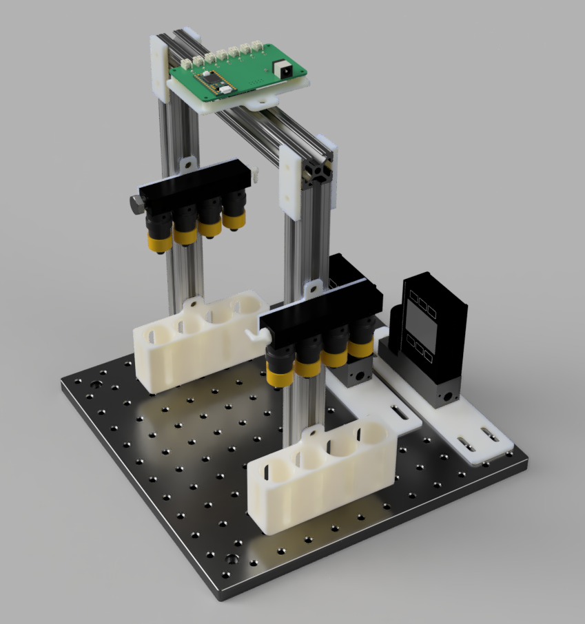

# Odour station

Hardware for delivering odours. Can be modified so that the second manifold controls for odour source direction, instead of providing additional odour types. Will Dickson designed the PCB for controlling the solenoid valves. Will Dickson wrote the [original firmware and software](https://github.com/willdickson/switchx7), which I [slightly modified](https://github.com/hanhanhan-kim/switchx7) so that valve command signals can be copied to the expansion port and streamed to an acquisition device, such as a DAQ. 

## Hardware

### BOM 

In addition to standard electronics equipment and access to a 3D-printer:

| Item                                                         | Price (USD) | Quantity        | Source                                                       |
| ------------------------------------------------------------ | ----------- | --------------- | ------------------------------------------------------------ |
| Valves*                                                      | 32.13       | 2 or more       | Clippard [EVO-3M-24-L](https://www.clippard.com/part/EVO-3M-24-L) |
| Manifold **                                                  | 17.14       | 1 or more       | Clippard [15481-4]()                                    |
| Barb fittings for valves                                     | 10.61 / 10  | 1 or more packs | Clippard [11752-1-ENP-PKG](https://www.clippard.com/part/11752-1-ENP-PKG) |
| Headless screw plug                                          | 8.93 / 10   | 1 or more packs | Clippard  [0035-2-PKG](https://www.clippard.com/part/0035-2-PKG) |
| Plug with external hex drive                                 | 1.06        | 1 or more       | McMaster-Carr [4515K208](https://www.mcmaster.com/4515K208/) |
| Barbed elbow fitting                                         | 7.68 / 1    | 1 pack          | McMaster-Carr 5121K631                                  |
| End-feed single nuts with button heads for t-slotted framing | 1.85 / 4    | 3 or more packs | McMaster-Carr [47065T139](https://www.mcmaster.com/47065T139/) |
| 80-20 beams***                                               | 5.84        | 3               | McMaster-Carr [47065T101](https://www.mcmaster.com/47065T101-47065T411/) |
| Silver gusset bracket for 80-20 beams                        | 6.54        | 2 or more       | McMaster-Carr [47065T663](https://www.mcmaster.com/47065T663/) |
| Breadboard                                                   | 155.53      | 1               | Thor Labs [MB12](https://www.thorlabs.com/thorproduct.cfm?partnumber=MB12) |
| Mass Flow Controller                                         | 1161.00     | 1               | Alicat MC-5SLPM-D 5M, RIN, 5IN, Gas: Air           |
| Mass Flow Controller                                         | 1161.00     | 1               | Alicat MC-500SCCM-D 5M, 5IN, GAS: Air              |

\* These valves can be fully ported, and so can be used as either 3-way or 2-way valves. I didn't quite figure out how to use them as 3-way diverting valves, so I've been using them as regular 2-way valves. 

** Or some other Clippard manifold that's compatible with Clippard's EV valves. 

*** Or whatever desired length.

Additional components for connecting and routing the tubing are necessary. The inlet and outlet of the mass flow controllers have 1/8 NPT threads. Upstream of the valves, I tend to use 1/8" ID tubing, and upstream of the mass flow controllers, I tend to use high-pressure-rated 1/4" ID tubing. Here are some parts I found generally useful for controlling fluid movements:

| Item                                                      | Price (USD) | Notes                                                        | Source                                                       |
| --------------------------------------------------------- | ----------- | ------------------------------------------------------------ | ------------------------------------------------------------ |
| Barbed inline filter for 1/4" tube ID                     | 6.25        | To filter particulates downstream of the breathing air's charcoal filter. | McMaster-Carr [8991T32](https://www.mcmaster.com/8991T32/) |
| High-pressure soft PVC tubing                             | 0.73 / ft   | To route air supply prior to the mass flow controllers' regulating functions. | McMaster-Carr [52375K12](https://www.mcmaster.com/52375K12/) |
| Barbed fitting for 1/8" tube ID x 1/8 NPT male            | 5.31 / 10   | To connect to mass flow controller's output  end.            | McMaster-Carr [5121K371](https://www.mcmaster.com/5121K371/) |
| Barbed fitting for 1/4" tube ID x 1/8 NPT male            | 5.58 / 10   | To connect to mass flow controller's input end.              | McMaster-Carr [5121K391](https://www.mcmaster.com/5121K391/) |
| Barbed fitting for 1/4" tube ID, wye connector            | 18.01 / 10  | To split the breathing air into the odour input mass flow controller and the carrier stream mass flow controller. | McMaster-Carr [5463K723](https://www.mcmaster.com/5463K723-2974K284/) |
| 90 degree barbed fitting elbow connector for 1/8" tube ID | 5.79 / 10   | To better route the tubing downstream of the mass flow controllers. | McMaster-Carr [5121K903](https://www.mcmaster.com/5121K903/) |
| Luer lock socket and barb for 1/8" ID                     | 4.36 / 10   | To add modularity to the components.                         | McMaster-Carr [51525K213](https://www.mcmaster.com/51525K213/) |
| Luer lock plug and barb for 1/8" ID                       | 3.87 / 10   | To add modularity to the components.                         | McMaster-Carr [51525K123](https://www.mcmaster.com/51525K123/) |
| Luer lock socket and barb for 1/4" ID                     | 4.25 / 10   | To add modularity to the components.                         | McMaster-Carr [51525K216](https://www.mcmaster.com/51525K216/) |
| Luer lock plug and barb for 1/4" ID                       | 4.89 / 10   | To add modularity to the components.                         | McMaster-Carr [51525K126](https://www.mcmaster.com/51525K126/) |

### Hook-up

The hook-up is straightforward. To connect the solenoid valves to the PCB, crimp the JST-PH terminals onto the leads of the valves. The valves do not possess polarity. Alternatively, if crimping the terminals is too cumbersome, simply splice [these pre-crimped JST-PH wires](https://www.sparkfun.com/products/8671) onto the solenoid leads. See the solenoid controller’s [documentation](https://github.com/willdickson/teensy3x_solenoid_driver) for remaining details. 

### Assembly

Print all 3D-printed components. Screw everything together—parts are generally assembled with 1/4"-20 screws or 8-32 screws, except for the mass flow controllers, which are mounted onto their adaptors via 8-32 screws. Parts for fluid management use 10-32-threads or 1/8"-NPT threads. Route the tubing as necessary. Use an activated charcoal filter upstream of both mass flow controllers, and then place an in-line particle filter downstream of the charcoal filter. 